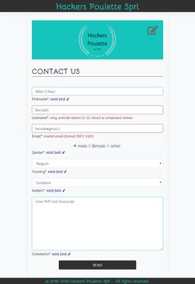
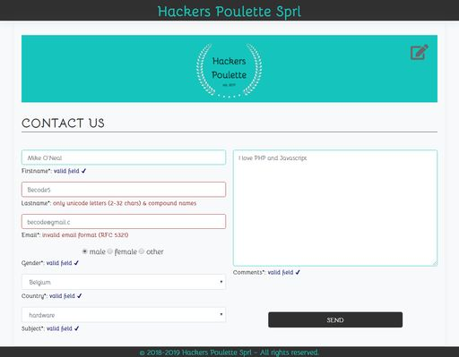

## Conception d'un formulaire de contact interactif en PHP 7

### Table des matières
* [Description](#Description)
* [Mock-up](#Mock-up)
* [Technologies](#Technologies)
  * [Front-end](#Front-end)
  * [Back-end](#Back-end)
* [Ressources](#Ressources)
* [Contact](#Contact)

### Description

Ce projet consiste  à concevoir un forumulaire de contact interactif en PHP 7 pour une marque fictive "Hackers-Poulette" dans le cadre de la formation **Fullstack** chez Becode.

Vous pouvez cliquer sur ce [lien](https://github.com/julio-34727/hackers-poulette) pour acceder au répo du projet.

### Mock-up
* Deux modèles de conception :
    * Petits écrans (&le; 768 px)
    * Grands/moyens écrans (> 768 px)

Small screen (&le; 768 px)            |  Big screen (> 768px)
:-------------------------:|:-------------------------:
  |  

### Technologies

Ce projet a été réalisé principalement avec les techologies frontend et backend. 

#### Front-end
* HTML5
* CSS3 (grid layout, box model, pseudo-classes, media-queries...)
* [Fonts](https://www.fontsquirrel.com/fonts/bellota) (Bellota font)
* JavaScript (Vanilla JS) : 
    * Code modulaire (fonctions).
    * Utilisation des expresions régulières.
    * Gestion des erreurs en temps réel (pendant la saisie).
    * Gestion des événements.

#### Back-end
* PHP 7.3.10 :
    * Code modulaire (fonctions, inclusion des fichiers)
    * Gestion des attaques XSS (htmlentities).
    * Nettoyage des champs avec SANITIZE.
    * Utilisation des expresions régulières.
    * Gestion des erreurs après soumission du formulaire.
    * Préservation des données en cas d'erreurs dans le formulaire.
    * Pot de miel pour la gestion des spams (champ invisible color).
    * Redirection vers la page d'erreur en cas de détection du spam.
    * Redirection vers la page de remerciements en cas de succès (formulaire correctement rempli).
* XAMP v3.2.4

### Ressources
* https://www.php.net/
* https://developer.mozilla.org/fr/
* https://www.w3schools.com/

### Contact

Projet réalisé par julio (<j.tusamba@gmail.com>) - contactez-moi!